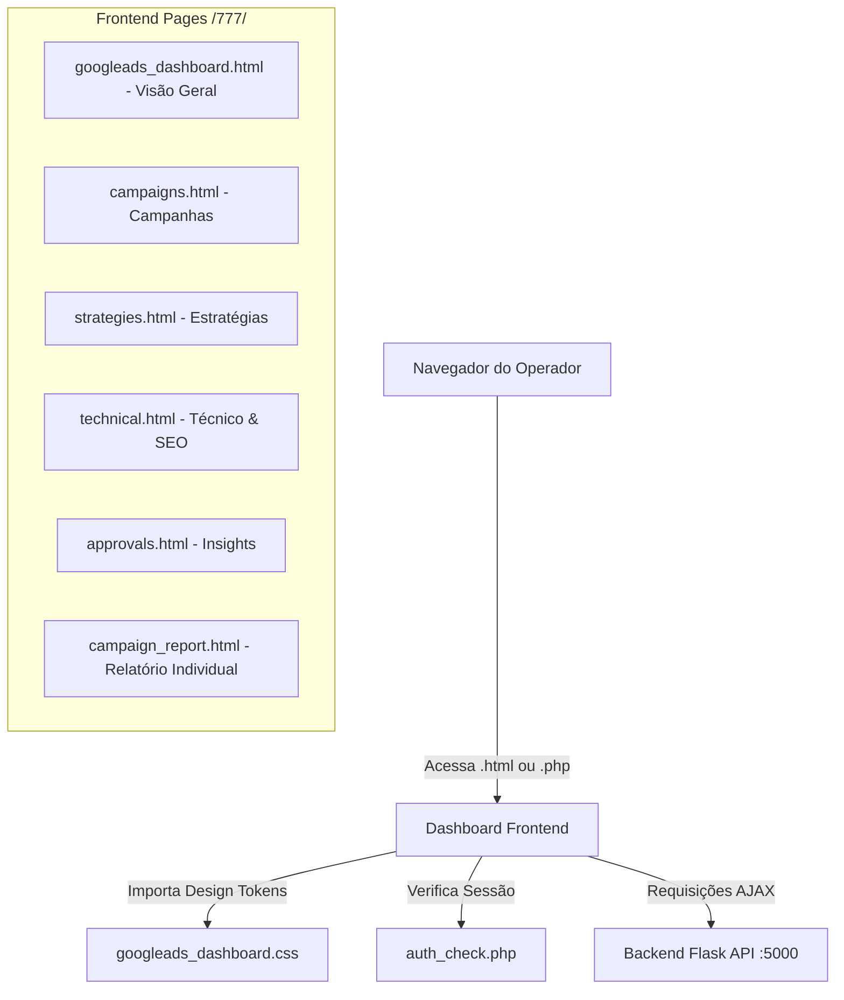

# Documentação do Dashboard Cyborg Google Ads AI Orchestrator

Esta documentação detalha a arquitetura, estrutura de arquivos, fluxo de dados e mecanismos de segurança do painel **Cyborg Google Ads — AI Orchestrator**, localizado no diretório `/777/` da aplicação.

---

## 1. Visão Geral da Arquitetura

O sistema é construído como uma aplicação web modular com suporte a dois modos operacionais principais (HTML estático para simulação local / PHP para produção com controle de sessão) que consome dados de um servidor de backend desenvolvido em Python (Flask) rodando localmente na porta `5000`.



---

## 2. Estrutura de Arquivos e Diretórios

Os arquivos estão organizados no diretório [777](file:///y:/PROJETOS/google%20ads/v1/meusite/777/) para isolar o sistema de inteligência artificial do restante do site principal:

*   **`googleads_dashboard.css`**: Design system unificado com estética *Cyberpunk* (Glows neon, fontes mono, paleta HSL e estilizações responsivas para tabelas, grids e formulários).
*   **`auth_check.php`**: Arquivo central que gerencia sessões PHP seguras e validação da chave criptográfica do orquestrador.
*   **Aba 1 (Visão Geral)**:
    *   [googleads_dashboard.html](file:///y:/PROJETOS/google%20ads/v1/meusite/777/googleads_dashboard.html): Dashboard de performance temporal com gráficos de cliques/conversões (Chart.js) e progresso de verbas.
    *   [googleads_dashboard.php](file:///y:/PROJETOS/google%20ads/v1/meusite/777/googleads_dashboard.php): Wrapper PHP autenticado.
*   **Aba 2 (Campanhas Ativas)**:
    *   [campaigns.html](file:///y:/PROJETOS/google%20ads/v1/meusite/777/campaigns.html): Listagem de campanhas ativas consumidas em tempo real do Google Ads, com botões para ativar/pausar campanhas.
    *   [campaigns.php](file:///y:/PROJETOS/google%20ads/v1/meusite/777/campaigns.php): Wrapper PHP autenticado.
*   **Aba 3 (Estratégias de IA)**:
    *   [strategies.html](file:///y:/PROJETOS/google%20ads/v1/meusite/777/strategies.html): Formulário de planejamento inteligente de campanhas via IA e edição de limites de orçamentos e CPA/CPC alvos.
    *   [strategies.php](file:///y:/PROJETOS/google%20ads/v1/meusite/777/strategies.php): Wrapper PHP autenticado.
*   **Aba 4 (Saúde Técnica & SEO)**:
    *   [technical.html](file:///y:/PROJETOS/google%20ads/v1/meusite/777/technical.html): Painel de tags de rastreamento (Ads/GTM), monitoramento de robots.txt, auditoria de sitemaps e log stream do GA4.
    *   [technical.php](file:///y:/PROJETOS/google%20ads/v1/meusite/777/technical.php): Wrapper PHP autenticado.
*   **Aba 5 (Insights & Aprovações)**:
    *   [approvals.html](file:///y:/PROJETOS/google%20ads/v1/meusite/777/approvals.html): Hub de recomendações da inteligência artificial onde o operador pode aprovar ou rejeitar alterações de lances e orçamentos.
    *   [approvals.php](file:///y:/PROJETOS/google%20ads/v1/meusite/777/approvals.php): Wrapper PHP autenticado.
*   **Relatório de Campanha (Modal Separada)**:
    *   [campaign_report.html](file:///y:/PROJETOS/google%20ads/v1/meusite/777/campaign_report.html): Página de análise profunda que substitui a modal antiga. Possui sub-abas para *Métricas*, *Pontos Fortes/Erros* e o *Relatório Completo em Markdown*.
    *   [campaign_report.php](file:///y:/PROJETOS/google%20ads/v1/meusite/777/campaign_report.php): Wrapper PHP autenticado.

---

## 3. Segurança e Controle de Acesso (PHP)

A segurança em ambiente PHP é gerenciada pelo arquivo central [auth_check.php](file:///y:/PROJETOS/google%20ads/v1/meusite/777/auth_check.php). O fluxo funciona da seguinte maneira:

1.  O arquivo inicia uma sessão segura com cookies `httponly` e controle `SameSite=Lax`.
2.  Quando uma requisição POST de autenticação é recebida, a chave digitada pelo operador é criptografada em `SHA-256` e validada contra a assinatura correta:
    `fc1b7a9976fa0826a827f334c30925963eb27dbc37048fddaeedf20a5edc1ab4`
3.  Se autenticado, o estado da sessão `cyborg_googleads_auth` é definido como `true`.
4.  Os arquivos `.php` individuais verificam a variável `$authenticated`. Caso seja falsa, renderizam o formulário de login unificado. Se for verdadeira, incluem (`include`) a respectiva página `.html`.

---

## 4. Roteamento Dinâmico de Extensões (.html ↔ .php)

Para garantir que o dashboard funcione tanto de maneira puramente estática (`localhost:8000/777/googleads_dashboard.html`) quanto através de um servidor Apache/PHP (`localhost/777/googleads_dashboard.php`), incluímos o seguinte script no ciclo de carregamento (`DOMContentLoaded`) de todas as páginas:

```javascript
window.addEventListener('DOMContentLoaded', () => {
    initDashboard();
    
    // Dynamic extension switcher
    if (window.location.pathname.endsWith('.php')) {
        document.querySelectorAll('.tab-navigation a').forEach(link => {
            const url = new URL(link.href, window.location.href);
            if (url.pathname.endsWith('.html')) {
                url.pathname = url.pathname.replace('.html', '.php');
                link.href = url.pathname + url.search;
            }
        });
    }
});
```

*Como funciona:* Se a URL atual termina com `.php`, o Javascript intercepta os links do menu e substitui a extensão `.html` de destino por `.php`, garantindo que o operador permaneça dentro do contexto autenticado do servidor PHP.

---

## 5. Integração com o Backend API (Flask)

O frontend consome a API RESTful baseada em Flask (`http://127.0.0.1:5000/api`). Abaixo estão os endpoints mapeados para cada página:

### 1. Status Geral (`/status`)
*   **Uso**: Monitorar o status de conexão da API real do Google Ads no cabeçalho do painel.
*   **Resposta**: `{"google_ads_api": "CONNECTED" | "SIMULATION"}`

### 2. Visão Geral (`/performance` & `/campaigns`)
*   **`/performance`**: Retorna dados temporais de cliques e conversões além dos KPIs agregados.
*   **`/campaigns`**: Retorna o orçamento diário consolidado para a barra de progresso de consumo mensal.

### 3. Campanhas Ativas (`/campaigns` & `/campaigns/<id>/report`)
*   **Uso**: Lista as campanhas, lendo alertas de anomalias de logs de navegação do site e redirecionando para a página de relatório individual.
*   **Ação**: `toggleCampaignStatus` envia requisições de ativação/pausa via API.

### 4. Estratégias de IA (`/strategies` & `/generate_campaign_structure`)
*   **`GET /strategies`**: Carrega as regras operacionais salvas (CPA Alvo, CPC Limite, etc.).
*   **`POST /strategies`**: Salva novas regras no banco/memória do servidor.
*   **`POST /generate_campaign_structure`**: Envia os parâmetros inseridos pelo operador para que a IA gere um dossiê completo de palavras-chave, avatares, dores e variações de anúncios de texto.

### 5. Saúde Técnica & SEO (`/infrastructure` & `/fix_robots` & `/fix_tags`)
*   **`/infrastructure`**: Carrega latência de tags, robots.txt, sitemaps e logs em tempo real do GA4.
*   **`/fix_robots`**: Dispara rotina do backend para ajustar permissões de rastreio de campanhas.
*   **`/fix_tags`**: Modifica os arquivos HTML correspondentes injetando scripts GTag pendentes.

### 6. Insights & Aprovações (`/insights` & `/approve`)
*   **`GET /insights`**: Lista as sugestões recomendadas pelo motor analítico (ex: pausar palavras ruins).
*   **`POST /approve`**: Executa a aplicação imediata da mudança na API de anúncios.

---

## 6. Fluxo da Página de Relatório Dedicado (`campaign_report.html`)

Ao clicar em uma campanha ativa na página `campaigns.html`, o fluxo operacional de renderização ocorre da seguinte forma:

```
[campaigns.html] -> Link click -> [campaign_report.html?id=23542530230]
                                             |
                                    Extrai ID da URL
                                             |
                                  Faz Fetch para o API
                       [/api/campaigns/23542530230/report]
                                             |
                                  Injeta Dados na Tela
                                             |
                       Renderiza Markdown no "Relatório Completo"
```

### Funções Javascript de Destaque:
*   **`URLSearchParams`**: Usado para extrair o ID da URL de forma limpa.
*   **`parseMarkdown()`**: Um parser Javascript regex otimizado e leve que converte o retorno em Markdown do backend para elementos HTML estilizados no padrão do design system sem a necessidade de bibliotecas externas pesadas.

---

## 7. Instruções de Desenvolvimento e Implantação

### Desenvolvimento Local (Modo Estático)
1. Certifique-se de que o backend Flask está rodando.
2. Inicialize o servidor de desenvolvimento na raiz do projeto:
   ```bash
   python -m http.server 8000
   ```
3. Acesse: `http://localhost:8000/777/googleads_dashboard.html`

### Produção / Staging (Modo PHP)
1. Certifique-se de que seu servidor Apache/Nginx possui suporte a PHP instalado.
2. Copie a pasta `/777/` para o diretório público do servidor web.
3. Configure a variável de sessão e acesse: `http://localhost/777/googleads_dashboard.php`

---

## 8. Funcionalidades Avançadas de IA (V2)

### 8.1 Funil de Vendas & Simulador (`funnel.html`)

A aba **Funil de Vendas** permite ao operador simular com sliders interativos como o investimento em Google Ads se transforma em receita ao longo das etapas do CRM:

**Etapas do Funil:**
1. **Impressões** (Google Ads) → 2. **Cliques no Anúncio** → 3. **Leads Gerados** → 4. **Leads Qualificados** → 5. **Oportunidades** → 6. **Vendas Realizadas**

**KPIs Calculados em Tempo Real:**
- Investimento Total (30d)
- Faturamento Estimado
- ROAS Final
- CAC Projetado (com alerta visual em vermelho se exceder o CAC Máximo configurado)

**Backend:** `GET /api/offline_funnel` com parâmetros: `daily_budget`, `cpc`, `lead_rate`, `qualified_rate`, `opportunity_rate`, `sale_rate`, `ticket_medio`, `cac_maximo`

---

### 8.2 Auditoria de Termos — Search Terms Miner (`campaign_report.html`)

Na sub-aba **"Auditoria de Termos (Miner)"** da página de relatório individual de campanha, o sistema busca os termos reais que ativaram os anúncios nos últimos 30 dias via `search_term_view` do Google Ads.

**Classificação Automática por IA:**
| Status | Condição |
|--------|----------|
| `NEGATIVAR` | Custo > R$ 15 e zero conversões |
| `ESCALAR` | 2 ou mais conversões |
| `MANTER` | Termo normal |
| `NEGATIVADO` | Já negativado pelo operador |

**Ação de Negativação:** O botão "🚫 Negativar" chama `negateSearchTerm(term)` que:
1. Posta para `POST /api/campaigns/<id>/negative_keywords`
2. Tenta aplicar na API real do Google Ads via `CampaignCriterionService`
3. Persiste localmente em `backend/negatives.json` como fallback

---

### 8.3 Compartilhamento Executivo (WhatsApp + PDF)

#### WhatsApp Share
O botão **"💬 Enviar WhatsApp"** extrai as métricas visíveis da campanha (Nome, Cliques, Custo, Conversões, CPC, Desperdício Oculto) e gera um link `wa.me/?text=` com o relatório formatado em markdown do WhatsApp.

#### Exportação PDF
O botão **"🖨️ Exportar PDF"** aciona `window.print()`. Um bloco `@media print` no `<head>` do `campaign_report.html` converte automaticamente o layout escuro para um tema branco profissional para impressão, incluindo:
- Todas as sub-abas expandidas (visíveis)
- Tabela de termos com bordas colapsadas
- Título da campanha visível
- Itens de diagnóstico com bordas coloridas verdes/vermelhas
- Sem elementos de UI (botões, toast, glow, header)

---

### 8.4 Gerador RSA com Checkboxes e Publicação de Rascunho

Na aba **Estratégias de IA**, o **Planejador Inteligente** gera:
- **15 Headlines** (Títulos) com checkboxes individuais para seleção
- **4 Descriptions** (Descrições) com checkboxes
- Campos de: Sitelinks, UTM Campaign, URL de Imagem, URL de Logotipo

O botão **"Publicar Rascunho no Google Ads"** envia os itens selecionados para `POST /api/publish_ad_draft`, que:
1. Tenta criar o anúncio RSA via `AdGroupAdService` com `status = PAUSED` (Rascunho)
2. Salva em `backend/draft_ads.json` como fallback local

---

### 8.5 Prompt Customizado de IA

Na seção **"Configurações do Motor de Orquestração"**, o campo **"Diretiva Personalizada de IA"** permite ao operador injetar uma instrução que altera o tom e o foco dos relatórios gerados. O texto é salvo em `strategies.json` como `custom_prompt` e incorporado em todos os relatórios de campanha e diagnósticos profundos da IA.

---

## 9. Arquivos de Persistência Local (Backend)

| Arquivo | Conteúdo |
|---------|----------|
| `backend/strategies.json` | Regras de IA, avatar, CPA/CPC alvos, prompt customizado |
| `backend/insights.json` | Insights gerados e seus status (PENDING/APPROVED) |
| `backend/negatives.json` | Palavras-chave negativadas por campanha |
| `backend/draft_ads.json` | Rascunhos de anúncios RSA publicados |

---

## 10. Integração Hostinger MySQL (V2.6)

O sistema de banco de dados centralizado Hostinger (`auth-db883.hstgr.io:3306`, DB: `u812937026_dash777`) unifica o tráfego do site com as análises do painel.

### 10.1 Fluxo de Registro de Leads
O arquivo [lead.php](file:///y:/PROJETOS/google%20ads/v1/meusite/base/api/lead.php) realiza a captura de leads do formulário do site e executa os seguintes passos:
1. Conecta-se via DSN PDO ao MySQL da Hostinger com timeout de 3 segundos.
2. Extrai parâmetros UTM (`utm_source`, `utm_campaign`, `utm_medium`) a partir do cabeçalho `HTTP_REFERER` ou dados explicitados no corpo do JSON do post.
3. Executa a query `INSERT INTO leads (ip, name, email, phone, message, utm_source, utm_campaign, utm_medium)` e persiste o lead para exibição no dashboard analítico.
4. Possui fallback automático para arquivo texto local `leads.log.php` caso o banco de dados esteja inacessível.

### 10.2 Auto-Snapshotting de Métricas de Campanha
As páginas de Visão Geral (`googleads_dashboard.html`) e Campanhas Ativas (`campaigns.html`) possuem um gancho Javascript que atua logo após carregar as campanhas em tempo real:
- Dispara uma requisição assíncrona POST para `/api/mysql_save_snapshot` enviando a lista atualizada de campanhas.
- A API do backend Flask intercepta a chamada e grava uma nova entrada na tabela `google_ads_snapshots` com as métricas históricas consolidando: cliques, impressões, custo, conversões, CTR e CPC médio de cada campanha no MySQL.

### 10.3 Nova Identidade Visual (Lottie Logo)
O player Lottie de animação (`logo.json`) de `index.html` foi portado e integrado ao cabeçalho (`.brand`) de todas as páginas do dashboard do orquestrador. A marca foi renomeada para **ORCHESTRATOR** e o subtítulo `Google Ads AI Manager (Basic Access)` foi removido para deixar o menu visualmente mais limpo e focado.
- O script `<script defer src="https://unpkg.com/@lottiefiles/lottie-player@latest/dist/lottie-player.js"></script>` foi adicionado ao header de todos os arquivos.
- A tag `<lottie-player>` é renderizada na dimensão de `50px` x `50px` alinhada horizontalmente com o título principal.
- Regra de `@media print` oculta a animação ao gerar relatórios executivos em PDF.


